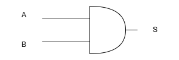
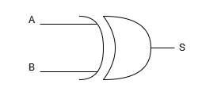

# Projeto-Unidade-Lógica_Aritmética
Este repositório contempla o projeto de uma unidade lógica aritmética com 13 operações distintas.

## Capítulo 1: Introdução

Esse relatório descreve os procedimentos realizados para a concepção do primeiro projeto da disciplina de Sistemas Digitais(ELE3515). Foi proposto projetar uma unidade lógica aritmética para fazer várias operações com dois números de 8 bits, além dos códigos em VHDL e testes no kit da DE2.
É um projeto de circuito digital a nível de componentes menores que podem ser combinados a fim de formar vários componentes maiores para fazer as operações em todos esses números de bits.
A figura abaixo mostra detalhadamente o esquema inicial do projeto proposto.

*Figura 1: Esquemático do Projeto da Ula*

As operações devem ser feitas todas em paralelo dentro da ULA, para então serem multiplexadas e a saída retornar apenas uma das 15 operações, que foi escolhida pela chave.
O diagrama de blocos abaixo mostra justamente o esquemático do projeto completo da ULA.

*Figura 2: Diagrama de blocos completo da Ula*

## Capítulo 2: Referencial Teórico

### 2.1 Algebra Booleana e Circuitos Digitais
A algebra booleana consiste em uma tupla $(x,[1,0],[+,\cdot,'])$, onde $x$ é um elemento do espaço vetorial booleano pode assumir apenas os valores 0 ou 1.
As operações são conhecidas como \textit{AND}, \textit{OR} e \textit{NOT}, que são operações comumente utilizadas em lógica propositiva, que pode ser vista como um isomorfismo desse espaço vetorial.

As propriedades da algebra booleana são mostradas abaixo:

| Propriedade          | Expressão         |
|----------------------|-------------------|
| Identidade           | $A + 0 = A$       |
|                      | $A \cdot 1 = A$   |
| Elemento nulo e unidade | $A + 1 = 1$       |
|                      | $A \cdot 0 = 0$   |
| Complemento          | $A + \bar{A} = 1$ |
|                      | $A \cdot \bar{A} = 0$ |
| Comutativa           | $A + B = B + A$   |
|                      | $A \cdot B = B \cdot A$   |
| Associativa          | $A + (B + C) = (A + B) + C$ |
|                      | $A \cdot (B \cdot C) = (A \cdot B) \cdot C$ |
| Distributiva         | $A \cdot (B + C) = (A \cdot B) + (A \cdot C)$ |
|                      | $A + (B \cdot C) = (A + B) \cdot (A + C)$ |
| Absorção             | $A + (A \cdot B) = A$ |
|                      | $A \cdot (A + B) = A$ |
| Idempotente          | $A + A = A$       |
|                      | $A \cdot A = A$   |
| Involução            | $\bar{\bar{A}} = A$ |
| De Morgan            | $\overline{A + B} = \bar{A} \cdot \bar{B}$ |
|                      | $\overline{A \cdot B} = \bar{A} + \bar{B}$ |
*Tabela 1: Tabela das Propriedades da Algebra Booleana*

### 2.2 Tabela Verdade e Mapa de Karnough
A tabela verdade de uma operação lógica é o conjunto de todas as entradas e todas as saídas possíveis referentes a todas essas entradas.

### 2.3 Portas Fundamentais

#### 2.3.1 Porta AND
A porta AND é uma operação que representa a intersecção de duas preposições, e tem a tabela verdade calculada pela expressão:

$S = A \cdot B$

A porta AND pode ser representada pela seguinte figura:

*Figura 3: Representação da Porta AND.*

Listando todas as combinações possíveis de A e B, como cada um tem um bit, e são $2^2 = 4$ combinações, temos a seguinte tabela verdade:

| A | B | S = A $\cdot$ B |
|---|---|-----------------|
| 0 | 0 | 0               |
| 0 | 1 | 0               |
| 1 | 0 | 0               |
| 1 | 1 | 1               |
*Tabela 2: Tabela verdade da porta AND.*

#### 2.3.2 Porta OR
A porta OR representa a ideia de adição de um bit, através da seguinte expressão:

$S = A + B$

Sua simbologia é mostrada pela figura abaixo:

*Figura 4: Representação da Porta OR.*

A tabela verdade da Porta OR para duas entradas:

| A | B | S = A $+$ B |
|---|---|-------------|
| 0 | 0 | 0           |
| 0 | 1 | 1           |
| 1 | 0 | 1           |
| 1 | 1 | 1           |
*Tabela 3: Tabela verdade da porta OR.*

A representação da Porta OR:

#### 2.3.3 Porta NOT
A Porta NOT, ou inversora, inverte o bit de entrada. Existem duas forma dela aparecer em uma expressão: através de uma barra, ou um apóstrofo, em cima da letra que repesenta a entrada.

$S = \overline{A}$

ou

$S = A'$

A tabela verdade da Porta NOT:

| A | S = A $+$ B |
|---|-------------|
| 0 | 1           |
| 1 | 0           |
*Tabela 4: Tabela verdade da porta NOT.*

#### 2.3.4 Porta XOR
A Porta XOR, ou OR exclusivo, para duas entradas terá a saída um quando apenas uma das duas estradas tiver o valor um e a outra entrada, obrigatoriamente, precisa ter o valor zero ~\cite{vahid}. A expressão que designa a Porta XOR é:

$S = A \oplus B$

A representação da porta XOR:

*Figura 5: Representação da Porta XOR.*

A tabela verdade da Porta XOR com duas entradas:

| A | B | S = $A \oplus B$ |
|---|---|-----------------|
| 0 | 0 | 0               |
| 0 | 1 | 1               |
| 1 | 0 | 1               |
| 1 | 1 | 1               |
*Tabela 5: Tabela verdade da porta XOR.*

### 2.4 Projeto Lógico Combinacional a nível de componentes
Em projetos de circuitos complexos, como o apresentado neste documento, é comum trabalharmos acoplando componentes pequenos para formar um maior, abstraindo ainda mais o conceito porém ficando com a ideia.
A próxima seção descreverá os principais blocos que irão compor o projeto do sistema de digital da ULA.

### 2.5 Blocos de Componentes Principais
Os principais blocos de componentes que são usados amplamaente nos projetos de sistemas digitais, como mostrados nos ~\cite{vahid}, serão discutidos abaixo.

#### 2.5.1 Somador de 1 Bit
Um somador de um bit é um somador que é capaz de receber a informação de um bit anterior, calcular a soma e verificar se há informação a ser repassada para a próxima casa.
Por mais que para um somador de um bit essa entrada e essa saída extra não façam muito sentido, quando cascateamos vários somadores percebemos a importância dessas variáveis adicionais para computar o resultado da soma corretamente.

O esquemático de um somador é mostrado abaixo:

*Figura 6: Esquemático do somador completo*

Como esse somador precisa ser capaz de somar 1 bit, podemos deduzir sua tabela verdade a partir disso como sendo:

| A | B | $C_{in}$ | R (soma) | $C_{out}$ |
|---|---|----------|----------|-----------|
| 0 | 0 | 0        | 0        | 0         |
| 0 | 0 | 1        | 1        | 0         |
| 0 | 1 | 0        | 1        | 0         |
| 0 | 1 | 1        | 0        | 1         |
| 1 | 0 | 0        | 1        | 0         |
| 1 | 0 | 1        | 0        | 1         |
| 1 | 1 | 0        | 0        | 1         |
| 1 | 1 | 1        | 1        | 1         |
*Tabela 6: Tabela verdade do somador completo (Full Adder).*

Utilizando agora o conceito de soma de produtos, a expressão lógica do somador é finalmente dada por:

$R = A'B'C_{i} + A'BC_{i}' + AB'C_{i}' + ABC_{i}$

e a expressão do bit do \textit{carrie out} é dada por:

$C_0 = A'BC_{i} + AB'C_{i} + ABC_{i}' + ABC_{i}$

Podemos usar as propriedades da algebra booleana ou o próprio mapa de Karnaugh para simplificar essa expressão.

Primeiro simplificando o \textit{carrie out}:
$C_0 = C_{i}(AB' + A'B) + AB( C_{i}' + C_{i})$

utilizando as propriedades da tabela 1 temos então:
$C_{i}' + C_{i} = 1$

e também:
$AB' + A'B = A \oplus B$

que é conhecida como a operação de OU exlusivo entre duas variáveis booleanas.

assim finalmente temos:
$C_0 = (A \oplus B)C_{i} + AB$

Agora simplificando o resultado da soma:
$R = A'B'C_{i} + A'BC_{i}' + AB'C_{i}' + ABC_{i} = C_i(A'B' + AB) +  C_i'(A'B + AB')$

mais uma vez essas operações dentro dos parênteses são conhecidas como XNOR e XOR, assim temos:
$R = C_i\overline{(A \oplus B)} + C_i'(A \oplus B)$

que pode ser simplificado mais uma vez como a operação XOR entre $C_i$ e $A \oplus B$, dado por:
$R = A \oplus B \oplus C_i$

#### 2.5.2 Multiplicador de 1 Bit
A multiplicação de 1 bit pode ser feita diretamente pela lógica da porta \textit{AND}, uma vez que sua lógica ja considera que $1 \cdot 1 = 1$, e que $A \cdot 0  = 0$, porém quando temos mais bits, podemos desenvolver a expressão para a multiplicação do mesmo jeito que aprendemos no ensino médio, expandindo e somando as possibilidades.

#### 2.5.3 Multiplexador Simples
Um multiplexador 2:1 possui duas entradas de dados ($I_0$ e $I_1$), uma linha de seleção $S$, e uma única saída $Y$.

*Figura 7: Esquemático do multiplexador simples*

A tabela verdade para todas as combinações possíveis de entrada é apresentada a seguir:

| S | $I_0$ | $I_1$ | Y |
|---|-------|-------|---|
| 0 | 0     | 0     | 0 |
| 0 | 0     | 1     | 0 |
| 0 | 1     | 0     | 1 |
| 0 | 1     | 1     | 1 |
| 1 | 0     | 0     | 0 |
| 1 | 0     | 1     | 1 |
| 1 | 1     | 0     | 0 |
| 1 | 1     | 1     | 1 |
*Tabela 7: Tabela verdade do multiplexador 2:1.*

Utilizando agora o conceito de soma de produtos, a expressão que pode ser obtida pela tabela é:

$Y = S'I_0I_1' + S'I_0I_1 +  SI_0'I_1 +  SI_0I_1$

agora usando as propriedades da algebra booleana, temos pela propriedade distributiva inversa, que:

$Y = S'I_0(I_1' + I_1) +  SI_1(I_0' + I_0) $

Utilizando mais uma vez a propriedade do elemento oposto ou complemento, a expressão simplificada do multiplexador é dada por:

$Y = S'I_0 +  SI_1$

#### 2.5.4 Deslocador de 1 bit
Um deslocador de 1 bit serve para mover as posições dos bits de uma entrada para direita ou para a esquerda, pode ser muito útil em aplicações principalmente para realizar operações matemáticas fundamentais, como por exemplo a conversão para binário.

Um deslocador de um bit pode ser representado pela figura abaixo:

*Figura 8: Deslocador de 1 bit.*

A entrada in normalmente é colocada para zero automaticamente, pois são as situações tratadas nos projetos convencionais.
A partir de um deslocador de 1 bit, um de 2 bits e um de 4 bits, conseguimos fazer um deslocador que pode deslocar qualquer quantidade que é combinação dessas 3, ou seja, um deslocador que desloca de 0 até 7 bits, chamado de deslocador de Barrel.

## Capítulo 3: Projeto

### 3.1 Projetando os blocos do circuito
A ULA é um circuito complexo que pode ser dividida em 15 sub blocos, que são as 15 operações requeridas no projeto, as 15 operações são feitas em paralelo e no final a saída de cada uma é multiplexada de acordo com o valor da chave seletora.

### 3.2 Somador de 8 bits
Utilizando o componente somador completo de 1 bit, mostrado anteriormente, é possível, cascateando n somadores em série, fazer um somador justamente de n bits, que nesse caso $n = 8$, como é mostrado abaixo:

*Figura 9: Esquemático do Somador de 8 Bits*

### 3.3 Subtrator de 8 bits
A ideia com o subtrator funciona de forma similar, a diferença é que vamos usar o conceito de complemento A2 para fazer essa operação, negando  a entrada que será subtraída da outra e adicionando 1 no \textit{carrie in}, como mostra a figura abaixo:

*Figura 10: Esquemático do subtrator de 8 bits*

Esse subtrator pode valer tanto para 1 tanto para n bits, se usarmos o somador completo, que recebe um número de 8 bits como um vetor, podemos abstrair e assumir que as operações são feitas elemento a elemento, e temos um subtrator completo.

### 3.4 Multiplicador de 8 bits
O circuito multiplicador é obtido de forma parecida, sua expressão lógica pode ser consultado no livro do Vahid ~\cite{vahid}, e é mostrado seu esquemático na figura abaixo:

*Figura 11: Esquemático do multiplicador de 4 bits*

O multiplicador de 4 bits resulta em uma saída de até 8 bits, então podemos usá-lo no nosso projeto, fazendo a multiplicação apenas entre os bits menos significativos, e para garantir um intervalo de reprsentação entre 0 e 1024, podemos ainda expandir para um multiplicador de 5 bits, cujas expressões lógicas são obtidas abaixo:
